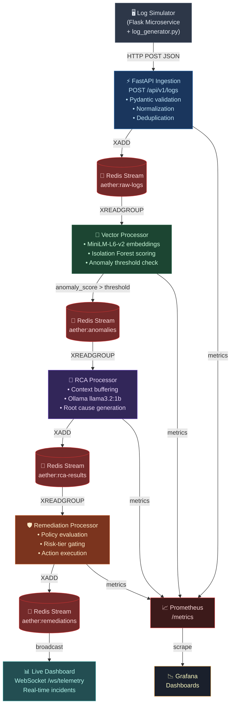
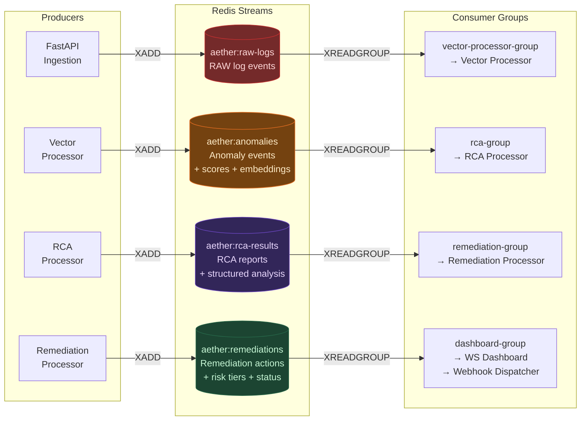
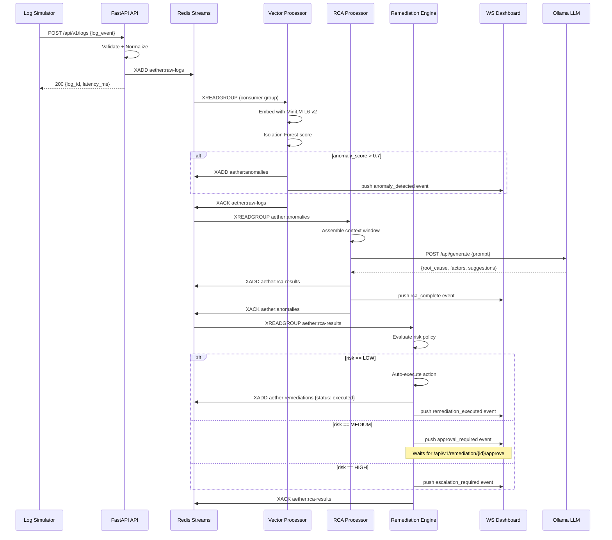
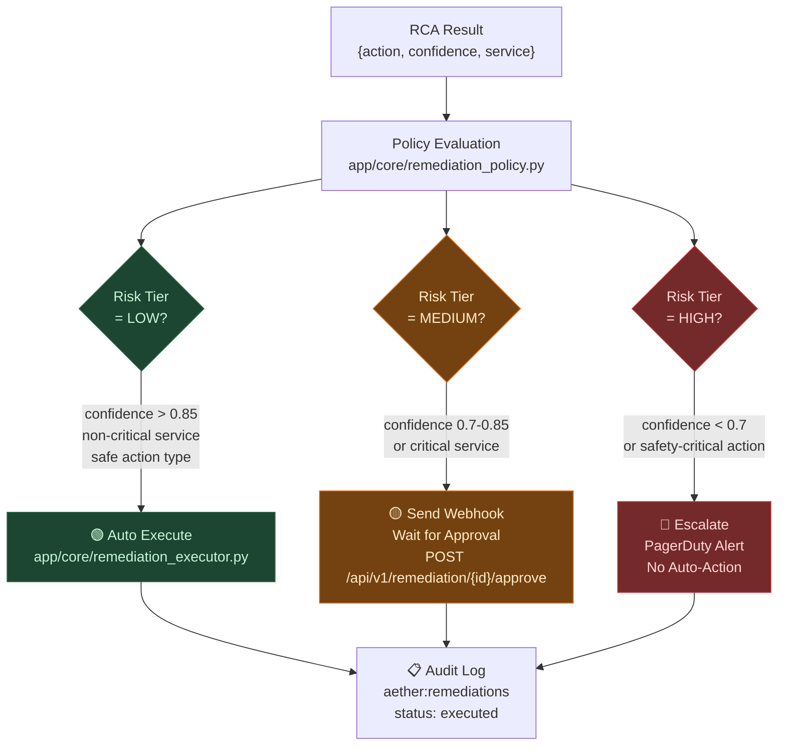
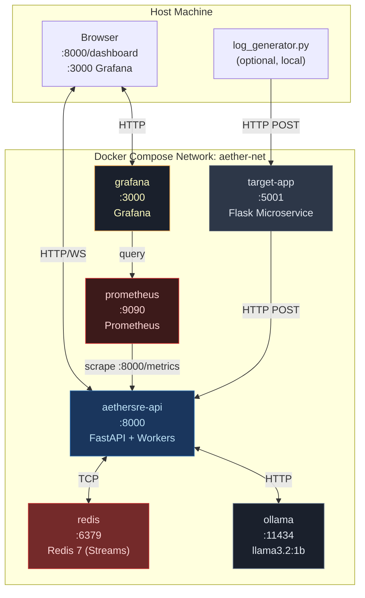

# AetherSRE — Architecture Deep Dive

> This document provides a comprehensive technical reference for the AetherSRE autonomous SRE pipeline, including component descriptions, data flows, and Redis Streams topology.

---

## Table of Contents

1. [High-Level Pipeline](#1-high-level-pipeline)
2. [Component Descriptions](#2-component-descriptions)
3. [Redis Streams Topology](#3-redis-streams-topology)
4. [Data Flow — Log to Remediation](#4-data-flow--log-to-remediation)
5. [Anomaly Detection Detail](#5-anomaly-detection-detail)
6. [RCA Generation Detail](#6-rca-generation-detail)
7. [Remediation Policy Engine](#7-remediation-policy-engine)
8. [WebSocket Dashboard](#8-websocket-dashboard)
9. [Observability Stack](#9-observability-stack)
10. [Deployment Topology](#10-deployment-topology)

---

## 1. High-Level Pipeline



---

## 2. Component Descriptions

### 2.1 FastAPI Ingestion Layer (`app/routers/ingestion.py`)

The entry point for all log data. Handles:

- **Pydantic model validation** via `LogEvent` schema (timestamp, service, level, message, metadata)
- **Multi-format normalization** using `app/core/normalizer.py` — supports JSON, logfmt, syslog, and raw text formats
- **Deduplication** via content hash comparison in a Redis sliding window
- **Async stream publish** via `XADD` to `aether:raw-logs` with automatic message ID generation
- **Prometheus counters** incremented per ingestion (total, by service, by level)

**Performance:** < 5ms p99 latency for single log events.

---

### 2.2 Vector Processor (`app/workers/vector_processor.py`)

The ML core of AetherSRE. Runs as a long-lived background coroutine consuming `aether:raw-logs`.

**Responsibilities:**
1. **Sentence Embedding** — calls `sentence-transformers/all-MiniLM-L6-v2` to produce 384-dimensional dense vectors from log message text.
2. **Vector Store Management** — maintains a rolling window of embeddings in `app/core/vector_store.py` (NumPy arrays backed by in-memory store with optional persistence).
3. **Isolation Forest Scoring** — uses a continuously re-fitted scikit-learn `IsolationForest` model to assign an anomaly score `[0, 1]` to each log. Scores > `ANOMALY_THRESHOLD` (default 0.7) are classified as anomalies.
4. **Anomaly Publishing** — anomalous logs (with score, embedding, and metadata) are pushed to `aether:anomalies` for downstream processing.

**Model Details:**
- Embedding model: `all-MiniLM-L6-v2` (22M params, 80MB, fast CPU inference)
- Anomaly model: `IsolationForest(n_estimators=100, contamination=0.1)`
- Rolling window: configurable (default 1000 logs)

---

### 2.3 RCA Processor (`app/workers/rca_processor.py`)

Generates human-readable Root Cause Analysis for anomalies using a local LLM.

**Responsibilities:**
1. **Context Assembly** — `app/core/context_buffer.py` maintains a sliding context window of recent logs from the same service, providing temporal correlation to the LLM.
2. **Ollama Inference** — sends structured prompt to `llama3.2:1b` via `app/core/llm_client.py` (async HTTP to `http://ollama:11434/api/generate`).
3. **Structured Output Parsing** — extracts root cause, contributing factors, affected components, and suggested remediation from LLM response.
4. **RCA Persistence** — result published to `aether:rca-results` and stored in Redis hash for later retrieval via `/api/v1/rca/{incident_id}`.

**Prompt Strategy:** Few-shot prompting with service context, anomaly score, correlated log window, and structured JSON output schema.

---

### 2.4 Remediation Processor (`app/workers/remediation_processor.py`)

Converts RCA results into actionable remediation steps and executes them based on risk policy.

**Responsibilities:**
1. **Policy Evaluation** — `app/core/remediation_policy.py` maps RCA output to a risk tier (LOW / MEDIUM / HIGH) based on service criticality, action type, and confidence score.
2. **Risk-Gated Execution:**
   - `LOW` risk → automatically executed via `app/core/remediation_executor.py`
   - `MEDIUM` risk → webhook notification sent; waits for approval via `/api/v1/remediation/{id}/approve`
   - `HIGH` risk → escalated to on-call (PagerDuty webhook); no auto-execution
3. **Audit Trail** — all actions (executed, pending, rejected) stored in `aether:remediations` stream and Redis hash.

---

### 2.5 Live Dashboard (`app/routers/dashboard.py`)

A server-rendered HTML dashboard with real-time WebSocket updates.

- **Static page** served at `GET /dashboard` — Jinja2 template with embedded CSS/JS
- **WebSocket endpoint** at `GET /ws/telemetry` — server pushes JSON messages for new incidents, anomaly scores, remediation statuses, and system metrics
- **Connection management** — broadcast to all connected clients; graceful disconnection handling
- **No polling** — pure push-based architecture

---

### 2.6 Log Simulator (`simulator/log_generator.py`)

A production-grade log generator that creates realistic, correlated anomaly scenarios:

| Scenario | Description |
|---|---|
| `cascading_failure` | DB timeout → connection pool exhaustion → upstream 503s |
| `memory_leak` | Gradual RSS growth → GC pressure → OOM |
| `ddos_spike` | Request rate surge → queue saturation → latency spike |
| `disk_full` | Disk usage warnings → write failures → service crash |
| `normal` | Baseline healthy log traffic with realistic variation |

---

## 3. Redis Streams Topology



### Stream Schema

**`aether:raw-logs`**
```json
{
  "log_id": "lg_01j3xyz...",
  "service": "payment-gateway",
  "level": "ERROR",
  "message": "Connection timeout...",
  "timestamp": "2026-07-05T18:30:00Z",
  "normalized": true,
  "metadata": { "host": "pay-gw-03", "region": "us-east-1" }
}
```

**`aether:anomalies`**
```json
{
  "incident_id": "inc_01j3...",
  "log_id": "lg_01j3xyz...",
  "anomaly_score": 0.87,
  "embedding_dim": 384,
  "service": "payment-gateway",
  "context_logs": ["...previous 5 logs..."],
  "detected_at": "2026-07-05T18:30:02Z"
}
```

**`aether:rca-results`**
```json
{
  "incident_id": "inc_01j3...",
  "root_cause": "Database connection pool exhausted due to long-running queries",
  "contributing_factors": ["DB query latency > 5s", "Pool size=10 saturated"],
  "affected_components": ["payment-gateway", "postgres-primary"],
  "remediation_suggestions": ["Increase pool size", "Add query timeout"],
  "confidence": 0.91,
  "model": "llama3.2:1b",
  "generated_at": "2026-07-05T18:30:07Z"
}
```

**`aether:remediations`**
```json
{
  "remediation_id": "rem_01j3...",
  "incident_id": "inc_01j3...",
  "action": "restart_service",
  "target": "payment-gateway",
  "risk_tier": "LOW",
  "status": "executed",
  "executed_at": "2026-07-05T18:30:08Z",
  "result": { "success": true, "duration_ms": 1240 }
}
```

---

## 4. Data Flow — Log to Remediation



---

## 5. Anomaly Detection Detail

### Embedding Pipeline

```
Raw Log Message
      │
      ▼
  Normalization
  (strip timestamps, IPs, UUIDs, hex → <TIMESTAMP>, <IP>, <UUID>)
      │
      ▼
  all-MiniLM-L6-v2
  (SentenceTransformers)
      │
      ▼
  384-dimensional dense vector
      │
      ▼
  Vector Store (rolling window N=1000)
      │
      ▼
  Isolation Forest
  (n_estimators=100, contamination=0.1)
      │
      ▼
  Anomaly Score [0.0 → 1.0]
      │
   > 0.7?
   ├── YES → publish to aether:anomalies
   └── NO  → XACK + discard
```

### Why Isolation Forest?

- **No labels required** — fully unsupervised, no training data needed
- **High-dimensional friendly** — works well on 384-dim embedding space
- **Computationally efficient** — O(n log n) tree construction, O(log n) inference
- **Interpretable score** — anomaly score directly proportional to isolation depth
- **Rolling refit** — model is periodically retrained on the latest N embeddings to adapt to evolving log distributions

---

## 6. RCA Generation Detail

### Prompt Template

```
System: You are an expert Site Reliability Engineer. Analyze the following log anomaly
and provide a structured root cause analysis.

Context window (last 5 logs from {service}):
{context_logs}

Anomalous log (score: {anomaly_score:.2f}):
{anomalous_log}

Respond ONLY with valid JSON matching this schema:
{
  "root_cause": "<one sentence>",
  "contributing_factors": ["<factor1>", "<factor2>"],
  "affected_components": ["<component1>"],
  "remediation_suggestions": ["<action1>", "<action2>"],
  "confidence": <float 0.0-1.0>
}
```

### LLM Client Configuration

- **Base URL:** `http://ollama:11434` (Docker) / `http://localhost:11434` (local)
- **Model:** `llama3.2:1b` (default, configurable via `OLLAMA_MODEL`)
- **Timeout:** 30s (async with `httpx`)
- **Retry logic:** 3 attempts with exponential backoff
- **Streaming:** disabled (full response awaited for structured parsing)

---

## 7. Remediation Policy Engine



### Risk Tier Mapping

| Action Type | Service Criticality | Confidence | Risk Tier |
|---|---|---|---|
| `restart_service` | low-criticality | > 0.85 | LOW |
| `scale_up` | any | > 0.80 | LOW |
| `restart_service` | high-criticality | any | MEDIUM |
| `drain_connections` | any | > 0.75 | MEDIUM |
| `failover_database` | any | any | HIGH |
| `rollback_deployment` | production | any | HIGH |

---

## 8. WebSocket Dashboard

The dashboard uses a single persistent WebSocket connection for all real-time updates.

### Message Types

| Event Type | Payload | Trigger |
|---|---|---|
| `anomaly_detected` | `{incident_id, service, score, message}` | Vector Processor anomaly |
| `rca_complete` | `{incident_id, root_cause, confidence}` | RCA Processor completion |
| `remediation_executed` | `{incident_id, action, result}` | Auto-executed LOW risk |
| `approval_required` | `{incident_id, action, risk_tier}` | MEDIUM risk pending |
| `escalation_required` | `{incident_id, reason}` | HIGH risk detection |
| `metrics_update` | `{ingestion_rate, anomaly_rate, queue_depths}` | Periodic (5s interval) |
| `health_check` | `{status, components}` | Periodic (30s interval) |

---

## 9. Observability Stack

### Prometheus Metrics

| Metric | Type | Description |
|---|---|---|
| `aether_logs_ingested_total` | Counter | Total logs ingested (by service, level) |
| `aether_ingestion_latency_seconds` | Histogram | Per-request ingestion latency |
| `aether_anomalies_detected_total` | Counter | Anomalies detected (by service) |
| `aether_rca_duration_seconds` | Histogram | LLM RCA generation time |
| `aether_remediations_total` | Counter | Remediations by tier and status |
| `aether_stream_lag` | Gauge | Consumer group lag per stream |
| `aether_embedding_duration_seconds` | Histogram | MiniLM embedding latency |

### Grafana Dashboards

Pre-built dashboards in `monitoring/grafana/`:

1. **SRE Overview** — ingestion rate, anomaly rate, active incidents
2. **Pipeline Latency** — per-stage p50/p95/p99 latency breakdown
3. **Remediation Tracker** — actions by tier, auto-execute rate, MTTR
4. **LLM Performance** — RCA generation time, model queue depth, confidence distribution

---

## 10. Deployment Topology



### Container Resource Recommendations

| Service | CPU | Memory | Notes |
|---|---|---|---|
| `aethersre-api` | 2 cores | 1.5GB | Includes MiniLM model weights |
| `redis` | 0.5 cores | 512MB | Streams + hash storage |
| `ollama` | 4 cores | 2GB | llama3.2:1b quantized |
| `prometheus` | 0.25 cores | 256MB | 15s scrape interval |
| `grafana` | 0.25 cores | 256MB | Dashboard rendering |
| `target-app` | 0.5 cores | 256MB | Flask microservice |

---

*Last updated: 2026-07-05 | AetherSRE v1.0*
